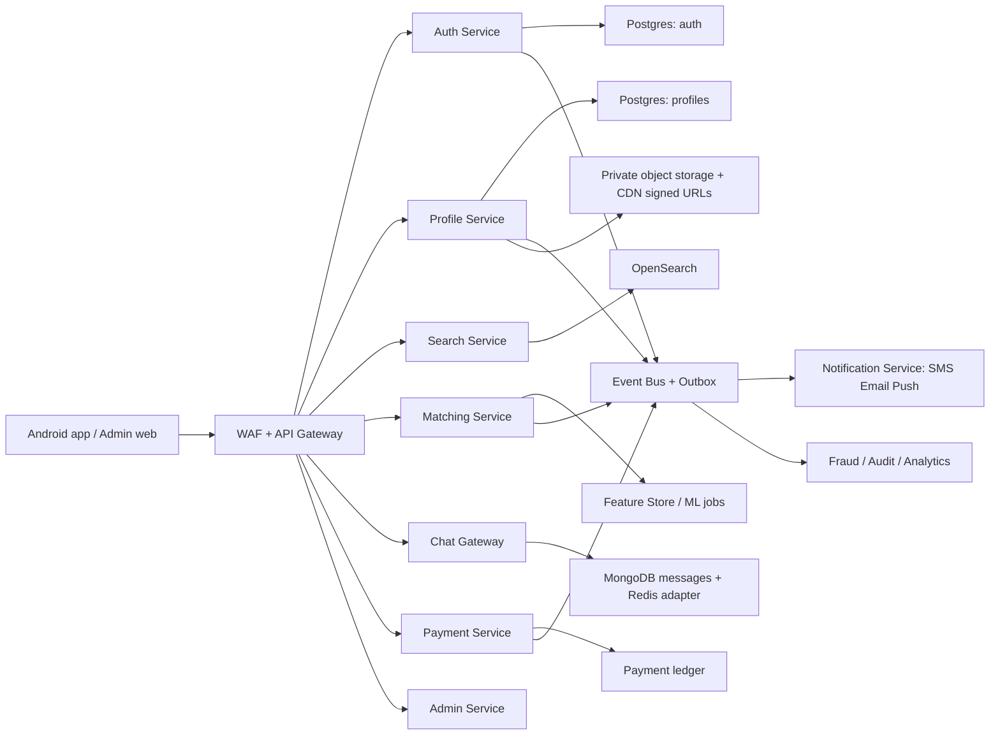

# Soulmatch Enterprise Code Audit and Gap Analysis

Audit date: 2026-04-30  
Scope: static audit of application-owned files in `admin-web`, `android/app/src`, `backend`, `database`, `docker`, `docs`, and `test_folder`. Generated/vendor/binary artifacts such as `node_modules`, Android/React build output, APKs, heap dumps, maps, images, `.pyc`, and logs were inventoried but not semantically audited.

## Executive Verdict

Soulmatch is a strong prototype with a real service split, Android Compose UI, admin web console, PostgreSQL schema, Mongo chat, Redis-backed auth, Razorpay, FCM, and Socket.IO foundations. It is not production ready. The current state has release-blocking auth, privacy, payment, notification, mock-data, secret-management, and authorization gaps. Do not launch this to real users until Phase 1 below is complete.

## Enterprise Baseline Used

Official competitor references show the expected market floor:

- BharatMatrimony advertises assisted matchmaking with relationship managers, scheduling, horoscope matching, profile visibility, refund guarantee, privacy controls, 100% mobile verified profiles, document-based Matrimony Stamp, references, and block/report behavior: https://www.bharatmatrimony.com/assisted/ and https://www.bharatmatrimony.com/privacy-security.php
- Shaadi.com advertises safety/privacy controls, verified phone numbers, report misuse, accept/decline blocking, premium contact/chat/video benefits, hidden-photo access, spotlight, and priority assistance: https://response.shaadi.com/introduction/index/safety-privacy-security and https://www.shaadi.com/info/introduction/membership-plans

## Critical Issues

| Severity | Area | Evidence | Required Fix |
|---|---|---|---|
| High | Secrets and prod hygiene | `client_secret_*.json`, `key.txt`, service `.env` files, `docker/production.env`, `android/local.properties`, `README.md:10-11`, APK, heap dump, logs exist in workspace | Rotate all exposed credentials, remove secrets/artifacts, use Vault/Secrets Manager/Docker secrets, add secret scanning in CI |
| High | Chat authorization bypass | `backend/chat-service/src/routes/chatRoutes.js:48` reads `/:chatId/messages` with no participant check | Verify requester is a participant before returning messages; derive chat IDs server-side; add negative tests |
| High | Public notification abuse | `backend/notification-service/src/routes/notificationRoutes.js:8-9` exposes `/send` and `/template` without auth | Require service-to-service auth, signed internal requests, queue/outbox, audit log |
| High | Payment integrity | `backend/payment-service/src/controllers/paymentController.js:68-114` verifies posted data but does not persist pending order, reconcile amount/plan, handle webhooks, or enforce idempotency | Add `payment_orders`, Razorpay webhooks, idempotency keys, amount/plan reconciliation, refund/failure states |
| High | Admin auth/RBAC | `backend/admin-service/src/controllers/adminController.js:23`, `adminAuthMiddleware.js:39`, `admin-web/src/pages/DashboardPage.js:134` | Remove `admin123`, require hashed admin users, MFA, lockout, per-route permissions, short-lived sessions, no localStorage tokens |
| High | Android production security | `AndroidManifest.xml:10,15`, `UserPreferences.kt:11-40`, `NetworkModule.kt` | Disable backup/cleartext in release, encrypt tokens with Keystore, use JSON serializers, enforce HTTPS |
| High | Mock/demo data leaking into prod behavior | Android ViewModels use `MarketFixtures` fallbacks across dashboard/search/profile/chat/subscription | Compile out all mock fallback in release; show real empty/error states |
| High | Profile privacy not enforced | `profileController.js`, `profileRepository.js`, Android local hide/block/report stores | Enforce visibility/photo/contact/privacy/block/report server-side in every profile/search/match/chat path |

## Architecture Review

Current architecture is service-shaped, not enterprise microservices. Services share one PostgreSQL schema, duplicate auth/database/control-plane logic, communicate mostly by synchronous REST, and lack an API gateway, service authentication, event bus, queue, outbox, schema ownership, versioned contracts, and centralized observability. Docker production publishes databases and every service port directly, which is not acceptable for internet-facing deployment.

Recommended target:

## Screen-by-Screen Audit

| Screen | Status | Gaps | Exact Fix |
|---|---|---|---|
| Login / Signup / OTP | Partially working | OTP uses mock constant in dev, weak resend throttling, Android resend countdown bug, no invite/referral capture, logout can be spoofed by body `userId` | Crypto OTP, hashed Redis OTP, per-phone/IP/device throttles, authenticated logout, referral fields, fixed resend state machine |
| Dashboard / Home | Partially working | Shows mock profiles/notifications when APIs fail; no true live notification stream | Remove release mocks, server-backed notification inbox, presence and match updates via events |
| Profile create/edit | Good UI foundation | No legal-age validation, no KYC/docs, no media scanning/resizing/moderation, no signed private photo URLs | Transactional profile save, KYC workflow, AV/photo moderation, S3 private bucket, signed URL policy |
| Match suggestions | Prototype | Binary gender logic, in-memory candidate scoring, backend ignores many UI filters, no reciprocal block/privacy checks | Search index + preference filtering, cached/offline match jobs, inclusive gender logic, entitlement-aware ranking |
| Search | Partially working | UI has filters backend ignores: community, mother tongue, education, occupation, income, marital status, manglik, verified/photo/recent/high-compatibility | Implement all filters in API, cap pagination, add composite/full-text indexes, reciprocal block/privacy checks |
| Chat / Messaging | Unsafe | REST history auth bypass, no media, no safety scanning, no delivery/read receipts, no horizontal Socket.IO adapter, no presence | Participant authorization, Redis adapter, moderation pipeline, receipts, media upload, reporting, retention policy |
| Subscription / Payment | Unsafe for revenue | Android package IDs do not cleanly match backend plans; no webhook/order ledger/renewal/refund/failure handling | Canonical plan catalog, order ledger, Razorpay webhook, renewal/refund flows, invoices/taxes/coupons |
| Admin panel | Broad but shallow | UI has many tabs, but backend RBAC is not enforced; verification/refund/campaign/chat logs are partial or placeholders | Real admin user/role tables, permissions middleware, audit trails, moderation queues, refund APIs, fraud console |

## Backend API Audit

### Auth service

- `src/app.js`: CORS is `*`; rate limiting is global only. Add per-route auth/OTP limits and strict allowed origins.
- `src/controllers/authController.js`: logout accepts `userId` from request body; referral redemption and account creation are not transactional; Google login does not link existing email/phone accounts safely.
- `src/routes/authRoutes.js:14`: `/logout` must require auth and use token subject, not body identity.
- `src/services/otpService.js:37,52`: OTP uses `Math.random`, plaintext Redis value, mock value, no send cooldown. Use cryptographic RNG, hash OTP, enforce resend limits, and never log OTP.
- `src/services/tokenService.js`: JWTs lack issuer/audience/jti/token-family reuse detection. Add rotation, session/device table, revocation.
- `src/repositories/userRepository.js`: parameterized queries are good, but schema needs uniqueness/linking constraints for OAuth identity merging.

### Profile service

- `src/app.js`: no rate limit; local uploads are statically served.
- `src/controllers/profileController.js`: returns full profile to any authenticated user; privacy, blocks, entitlement, and verification status are not enforced.
- `src/repositories/profileRepository.js`: multi-step profile saves are not transactional; `recordView` unique insert never refreshes repeat views; completion writes during reads.
- `src/routes/profileRoutes.js`: upload validates MIME only; no image signature check, resizing, metadata strip, content moderation, or malware scan.
- `src/services/mediaService.js`: object URLs are public and delete does not remove remote objects. Use private bucket and signed URLs.

### Search service

- `src/controllers/searchController.js:12-43`: limit is not capped; backend only supports a small subset of UI filters; block check is one-way only; privacy/photo visibility ignored.
- `src/routes/searchRoutes.js`: saved search has no max count, dedupe, update/delete, alert scheduling, or notification integration.

### Matching service

- `app/main.py`: CORS is `*`; no rate limiting.
- `app/middleware/auth.py`: JWT checks lack issuer/audience and use raw environment fallback.
- `app/services/matching_engine.py:26-39`: binary gender assumption, loads only 200 candidates, scores in memory, ignores reciprocal blocks, privacy, admin status, premium ranking, and preference completeness.
- `app/services/interest_service.py`: interest sends are not quota/plan limited; notification call is unauthenticated best-effort REST; no queue/outbox; accept does not create a conversation record.

### Chat service

- `src/routes/chatRoutes.js:48-53`: message history endpoint does not verify participants and accepts unbounded limit.
- `src/socket/socketHandlers.js`: send path checks mutual interest, which is good, but typing events and metadata need relationship validation; no abuse detection or horizontal scaling.
- `src/models/Message.js` and `Conversation.js`: indexes exist, but no encryption, retention, deletion, reporting, or archival policy.

### Notification service

- `src/routes/notificationRoutes.js:8-9`: public send/template endpoints are a serious abuse vector.
- `src/controllers/notificationController.js`: notification inbox/read APIs are stubs; no persistence, retries, dead-letter queue, provider logs, or template versioning.
- `src/services/fcmService.js`: no invalid-token cleanup or delivery audit.

### Payment service

- `src/controllers/paymentController.js`: no pending order persistence, no webhook, no idempotency, no amount reconciliation, no refund integration, no renewal lifecycle, and upgrade packages are missing from default runtime config.
- `src/routes/paymentRoutes.js`: payment APIs need strict rate limiting and fraud signals.

### Admin service

- `src/controllers/adminController.js`: dev admin fallback, degraded empty-success responses, partial refunds, partial verification workflow, partial campaign handling, chat logs based on analytics that chat does not write.
- `src/middleware/adminAuthMiddleware.js`: role helper exists, but routes do not enforce granular permissions.
- `src/realtime/adminRealtime.js`: polling snapshots are acceptable for prototype, not event-driven monitoring; fallback secret is dangerous.
- `src/controllers/publicController.js`: public analytics accepts arbitrary caller-controlled `userId` and event type, allowing data pollution.
- `src/services/adminSchema.js`: runtime DDL duplicates migrations. Use migrations only.

## Database Review

Strengths: normalized core tables, UUIDs, JSON config, analytics/audit tables, interests/blocks/reports/verifications present.

Problems:

- Missing composite indexes for common matchmaking queries: `(gender, is_published, admin_status, religion, caste, city)`, age range, verification status, last active.
- Missing indexes: `profile_photos(profile_id)`, `blocks(blocked_id)`, `reports(status, created_at)`, `transactions(user_id, status, created_at)`, saved-search alert schedules.
- No full-text/trigram indexes for name/community/city/occupation search; no OpenSearch sync.
- No notification table, device token table, payment order ledger, admin user table, RBAC permissions table, fraud signals table, conversation SQL mirror, or outbox table.
- Migrations duplicate schema content and admin service runs DDL at startup. Move to one migration tool with versioned migrations.
- Production compose initializes seed data. Never seed demo users/plans into prod without controlled fixtures.

## Frontend and Android File-Level Findings

### Admin web

- `admin-web/package.json`: CRA `react-scripts` stack is stale. `npm audit --omit=dev` reports 28 vulnerabilities: 14 high, 5 moderate, 9 low.
- `admin-web/package-lock.json`: only admin web has a lockfile; most backend services do not. Add lockfiles or move to pnpm/yarn workspaces.
- `admin-web/src/App.js`: route guard only checks token presence.
- `admin-web/src/api/adminApi.js`: stores bearer token in localStorage; use secure httpOnly admin session or hardened token storage with CSP.
- `admin-web/src/pages/LoginPage.js`: prefilled admin email, no MFA/CAPTCHA/lockout UX.
- `admin-web/src/pages/DashboardPage.js:66,720-768`: UI exposes `client_integrations`, `matching`, `registration`, `security` config saves that backend rejects because `CONFIG_KEYS` excludes them.
- `admin-web/src/pages/DashboardPage.js:1044`: logout only clears localStorage; no server revocation.
- `admin-web/src/pages/UsersPage.js`: errors degrade to empty list and hide operational failures.
- `admin-web/build/*` and logs: generated output/logs should not be source-controlled or shipped in audit bundles.

### Android app

- `android/app/build.gradle`: release config depends on local properties for public keys; debug logs BODY. Add release-safe logging config and CI secret injection.
- `android/app/src/main/AndroidManifest.xml:10,15`: `allowBackup=true` and `usesCleartextTraffic=true`. Release blocker.
- `data/local/UserPreferences.kt`: stores tokens in plain DataStore. Use EncryptedSharedPreferences/DataStore with Android Keystore.
- `data/network/NetworkModule.kt`: manual refresh JSON string and `runBlocking` in interceptor/authenticator. Use Retrofit model serialization and non-blocking session refresh pattern.
- `data/network/ApiService.kt`: contracts expose limited filters and miss referral/acquisition payload fields.
- `data/models/Models.kt`: runtime config includes fields backend does not return.
- `services/SoulMatchFCMService.kt:10`: `onNewToken` is empty. Register token with backend; add Android O+ notification channels and `POST_NOTIFICATIONS`.
- `MainActivity.kt`: runtime config polling every 45 seconds is battery/network heavy; use ETag, backoff, and app lifecycle awareness.
- `ui/screens/auth/OTPVerificationScreen.kt:35-53`: resend countdown uses `LaunchedEffect(Unit)`, so after resend it will not reliably restart.
- `ui/screens/auth/WelcomeScreen.kt`: Apple login disabled; copy claims end-to-end encryption although chat is not E2E encrypted.
- `ui/screens/profile/ProfileWizardScreen.kt`: comprehensive UI, but date/age validation and KYC/photo verification are missing.
- `ui/screens/profile/ProfileDetailScreen.kt:433`: "Share family" button has no functional handler. Hide/block/report are local-only via ViewModel/store.
- `ui/screens/search/SearchScreen.kt`: rich filters are mostly UI-only because backend ignores them.
- `ui/screens/chat/ChatScreen.kt` and `ChatListScreen.kt`: real chat exists but attachments, voice, calls, receipts, typing UI, and safety controls are placeholders/missing.
- `ui/screens/subscription/SubscriptionScreen.kt`: Razorpay UI exists but relies on local/mock package data when backend config is missing.
- `data/mock/MarketFixtures.kt` and ViewModel fallbacks: useful for demos, dangerous in release. Gate behind debug-only source set.

## Infra and Supply Chain

- `docker/docker-compose.prod.yml`: exposes Postgres, Mongo, Redis, and every service port publicly; no TLS, WAF, gateway, resource limits, replicas, health-gated deploy, or secret manager.
- `docker/prometheus.yml`: only admin-service metrics are scraped. Add metrics to every service and scrape all.
- `backend/*/package.json` and `admin-web/package.json`: Node lockfiles are now present and Dockerfiles use reproducible `npm ci` installs with audit/fund network calls disabled during image builds. Backend service `.dockerignore` files now exclude `node_modules`, logs, local env files, and build artifacts from image contexts. Still required: CI dependency/container scanning and base image pinning/refresh policy.
- `backend/profile-service/package.json`: `multer 1.4.5-lts.1` should be revisited; upload path needs hardening regardless of package.
- `backend/admin-service`: `npm audit --omit=dev` returned zero vulnerabilities for current lockfile.
- `.gitignore`: good intent, but sensitive files and generated artifacts still exist in workspace.

## Enterprise Comparison

| Feature | Soulmatch | BharatMatrimony / Shaadi.com baseline | Gap |
|---|---|---|---|
| Phone verification | OTP exists | Verified phone numbers are a trust signal | Add strict anti-abuse, verified-contact display rules |
| Document/KYC verification | Tables exist, workflow partial | BharatMatrimony Matrimony Stamp verifies education/residence/payslip | Build document upload/review/privacy and visible trust badges |
| Privacy controls | Stored but weakly enforced | Photo/horoscope/reference/contact privacy controls | Enforce in every backend query and entitlement decision |
| Assisted matchmaking | Missing | Relationship manager, shortlist, schedule meetings/video calls | Add assisted CRM workflow, assignment, tasks, SLA |
| Horoscope/community matching | Basic fields only | Horoscope matching and community-specific choices | Add astro fields, compatibility rules, community portals/segments |
| Messaging/contact | Basic chat | Premium direct messages, chat, video, contact visibility | Add entitlement-aware chat/contact/video and receipts |
| Abuse/fraud | Reports table and admin tab partial | Report misuse, decline blocks, customer service follow-up | Add moderation queues, fraud scoring, evidence, SLA dashboards |
| Monetization | Plans and Razorpay start | Multi-tier plans, spotlight/bold listing, guarantees | Add plan catalog, boosts, renewals, refunds, guarantees |
| Notifications | FCM send only, stubs | Multi-channel user engagement | Add persisted inbox, SMS/email/push queues, retries |
| Admin ops | Broad UI prototype | Verification, fraud, analytics, support operations | Add RBAC, audit, workflow states, analytics correctness |

## Good Implementations

- Clear domain split: auth, profile, search, matching, chat, notifications, payments, admin.
- Parameterized SQL is used in most backend paths.
- Redis-backed OTP/refresh-token foundation exists.
- Android Compose UI is broad and reasonably polished.
- Socket.IO chat and admin realtime foundations exist.
- PostgreSQL schema covers many core matrimony entities.
- Razorpay, Firebase, Twilio, S3, and runtime config are already anticipated.

## QA and Testing

Observed tests:

- `test_folder/api-smoke.js`
- `test_folder/auth-flow-smoke.js`
- `android/app/src/test/.../MarketFixturesTest.kt`
- `android/app/src/test/.../UpgradeRouteMappingTest.kt`
- `android/app/src/test/.../UpgradeStateRestorationTest.kt`

Missing tests:

- Backend unit/integration tests for auth, OTP throttling, JWT refresh, logout, profile privacy, search filters, reciprocal block, matching, interests, chat authorization, payment webhooks, notification auth.
- Admin RBAC and audit-log tests.
- Android ViewModel tests for no mock fallback in release, OTP resend, profile save failure, payment mismatch, notification registration.
- E2E tests: signup to profile completion, interest accept to chat, subscription purchase, admin verification, report resolution.
- Security tests: IDOR, auth bypass, rate limiting, upload validation, XSS, CSRF, secret scanning, dependency scanning.
- Load tests: search/matching at 1M profiles, chat fanout, notification bursts, admin dashboards.

## Enterprise Readiness Checklist

- [~] Secrets rotated and removed from repo/workspace artifacts. `.gitignore` now excludes `docker/production.env`, heap dumps, APKs, and local secrets, and `docker/production.env.example` documents safe placeholders. Operator action still required: rotate every credential that existed in local files and remove the live local secret files.
- [~] Production Docker/Kubernetes does not expose databases or internal services. `docker-compose.prod.yml` no longer publishes Postgres/Mongo/Redis and binds service/admin ports to localhost. Still required: put a real TLS API gateway/reverse proxy in front.
- [x] Development Docker compose image build is reproducible. `admin-web/package-lock.json` was regenerated with Node 20/npm 10 compatibility, Node Dockerfiles use `npm ci --audit=false --fund=false`, and backend service `.dockerignore` files prevent `node_modules`/secrets/logs from bloating build contexts. Verified with `docker compose --progress=plain -f docker/docker-compose.dev.yml build`.
- [~] API gateway/WAF, TLS, allowed CORS origins, service-to-service auth. Notification `/send` and `/template` now require `x-internal-service-secret`; matching service sends that header. Still required: gateway, WAF, TLS termination, strict CORS on every service.
- [x] No mock fixture fallback in release apps for main production flows. Android dashboard/search/profile/detail/interests/chat/subscription/settings now gates fixture fallbacks behind `BuildConfig.DEBUG`.
- [~] Payment order ledger, webhooks, refunds, idempotency. Added `payment_orders`, order reconciliation, strict Razorpay signature verification, webhook endpoint, idempotent already-paid response. Still required: real refund gateway integration, renewal jobs, invoice/tax workflow.
- [~] Privacy/block/report enforcement in profile, search, match, chat, admin. Added profile visibility checks, reciprocal block exclusion in search/matching/profile, chat participant check, server block/report APIs, admin verification status propagation. Still required: full hide/unhide API, contact entitlement enforcement, complete admin moderation workflow.
- [~] Notification persistence, queues, retries, provider logs. Added `notifications` table, inbox/read APIs, FCM token registration, persisted push attempts, service-authenticated dispatch. Still required: queue worker, retry/DLQ, SMS/email providers, delivery dashboards.
- [~] Real RBAC/MFA/admin users/permission middleware. Added per-route role gates and disabled plaintext admin password in production. Still required: admin user table, MFA, lockout, session store, permission editor.
- [~] Migration discipline and schema ownership. Added `004_enterprise_hardening.sql` and schema updates for orders/notifications/indexes. Still required: consolidate duplicate migrations/runtime DDL into one migration tool.
- [ ] Observability: metrics, logs, traces, alerts, SLOs. Not implemented in this pass.
- [ ] Backups, restore drills, DR runbooks. Not implementable locally; needs infra runbooks and scheduled drills.
- [~] Security testing and dependency scanning in CI. Generated backend lockfiles and reduced prod audit results to zero for all checked packages except notification-service transitive Firebase advisories. Still required: CI pipeline, SAST/DAST, container scan, secret scan gates.

## Step-by-Step Roadmap

### Phase 1: Fix Core Release Blockers

1. Rotate/remove secrets and artifacts; add secret scanning.
2. Lock production network surface: gateway only, no public DB/Redis/Mongo/service ports.
3. Fix auth: authenticated logout, OTP crypto/throttling, JWT claims/rotation, strict CORS.
4. Fix chat history IDOR and add participant tests.
5. Fix notification endpoint auth and disable public send/template.
6. Remove release mock fallbacks in Android and admin.
7. Disable Android backup/cleartext; encrypt tokens.
8. Add payment order ledger, amount checks, webhook signature verification, idempotency.

### Phase 2: Complete Enterprise Features

1. Verification/KYC workflow: document upload, reviewer queue, trust badges, privacy controls.
2. Server-side block/hide/report enforcement and moderation workflow.
3. Real notification inbox plus SMS/email/push templates, retries, DLQ.
4. Full search filter parity with Android UI.
5. Entitlement-aware chat/contact/photo/name access.
6. Admin RBAC, MFA, audit logs, refund/campaign/role/profile-verification tooling.

### Phase 3: Scale to 1M+ Users

1. Add API gateway, OpenSearch, Redis caching, CDN, object storage signed URLs.
2. Split database ownership or schemas by service; add outbox/event bus.
3. Move matching to offline/batch candidate generation plus online re-ranking.
4. Add Socket.IO Redis adapter and presence service.
5. Add queue-backed notifications and async analytics.
6. Add read replicas, partitioning/archival for analytics/chat/profile views.

### Phase 4: Production Readiness

1. CI/CD with lint, tests, SAST, dependency scan, secret scan, container scan.
2. Full observability: Prometheus/Grafana for all services, structured logs, tracing, alerts.
3. Backup/restore drills, incident runbooks, DR strategy.
4. Privacy/legal: data export/delete, retention policy, consent, audit trails.
5. Performance tests, chaos drills, release gates, canary deployments.

## Bonus AI Features

- Match scoring engine: offline feature generation plus explainable score cards.
- Fraud detection: duplicate photo/phone/device/IP graph, payment-risk signals, scam text classifiers.
- Profile recommendation: collaborative filtering plus preference-aware re-ranking.
- Moderation assist: image/document OCR checks, unsafe chat nudges, report triage summaries.
