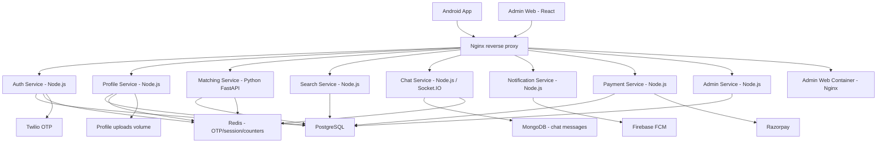
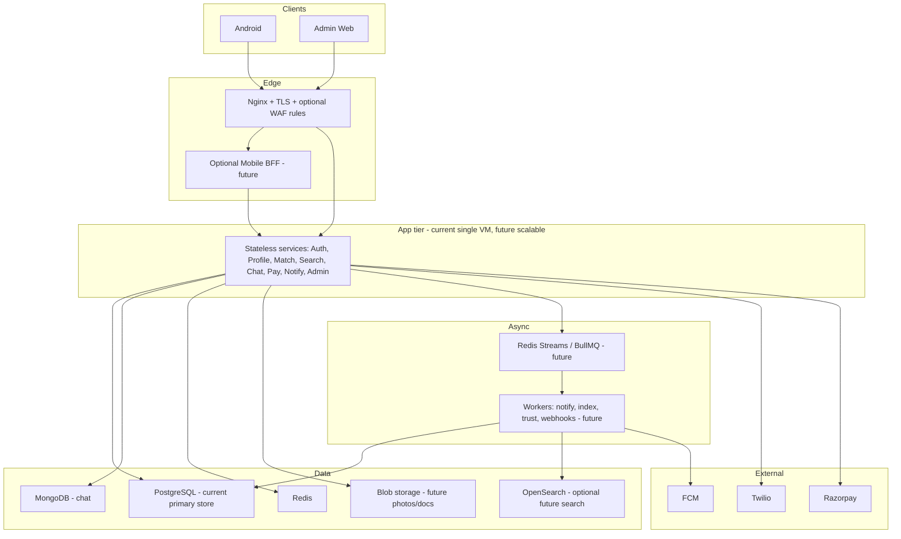
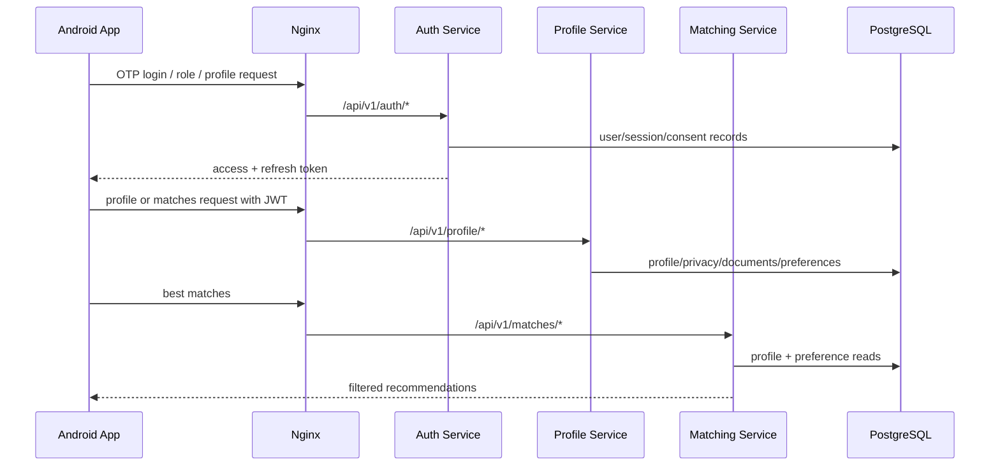
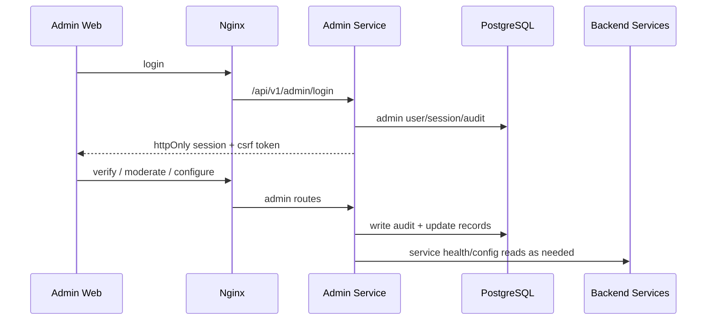
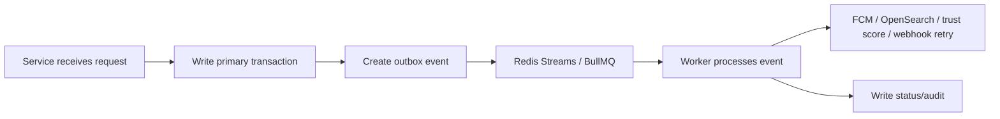

# SoulMatch Architecture Foundation

This document explains the current SoulMatch architecture and the target extensible design. It is written for future developers so they can understand where each responsibility belongs before changing code.

## Cost-Safe Architecture Rule

SoulMatch is still in development. Keep monthly Azure cost under the agreed development budget by default.

Do not add these resources without explicit approval:

- Extra VM.
- Load balancer.
- Azure Application Gateway / paid WAF.
- Managed PostgreSQL.
- Managed Redis.
- OpenSearch / Elastic / Azure AI Search.
- High-volume Log Analytics ingestion.

Approved low-cost direction:

- Keep the current single VM Docker deployment.
- Keep Nginx as the public edge.
- Add extension placeholders in code/docs first.
- Move to paid managed services only when moving toward live public launch.

## Current Production Architecture

Current deployed commit: tracked in `/home/azureuser/soulmatch/.soulmatch-deployed-version.json` on the VM.



## Target Extensible Architecture

This is the direction, not an immediate infrastructure change.



## Implemented Now vs Future Placeholder

| Capability | Current Implementation | Future Extension Point | Status |
| --- | --- | --- | --- |
| Edge routing | Nginx on single VM | TLS, stricter WAF rules, domain routing | Partially implemented |
| Mobile API | Android calls backend services via Nginx route paths | `backend/mobile-bff/` can aggregate mobile-specific calls | Placeholder only |
| Auth | `backend/auth-service` | Add device risk scoring and stronger duplicate detection | Implemented with room to extend |
| Profiles | `backend/profile-service` | Move media/documents to Blob adapter | Implemented with room to extend |
| Matching | `backend/matching-service` | Worker-generated rankings and async recalculation | Implemented with room to extend |
| Search | PostgreSQL filters/search | OpenSearch adapter behind `search-service` | Placeholder only |
| Chat | Node service + Mongo + Socket.IO | Redis adapter already prepared; future moderation worker | Partially implemented |
| Notifications | Notification service + FCM | Outbox worker, queue-backed retries | Partially implemented |
| Payments | Razorpay order/verify/webhook | Async webhook worker and invoice pipeline | Partially implemented |
| Admin | React admin + admin API | SSO/MFA enforcement and stronger admin audit workflows | Partially implemented |
| Observability | `/metrics`, docs, dashboard JSON | Run Prometheus/Grafana/alerts in production | Placeholder/ready |
| Backups | Backup/restore scripts | Automated scheduled backup + restore drill | Placeholder/ready |
| Operational config | Private `operations` config and `architectureFlags` helper | Adapter activation gates for BFF, workers, blob, search, WAF, observability | Placeholder/ready |

## Request Flow

### Member app flow



### Admin flow



## Async Flow Placeholder

Current code already has some outbox/worker foundation, but do not move all request-path logic into queues until each feature is tested.

Future worker location:

```text
backend/
  workers/
    notification-worker/
    trust-score-worker/
    search-index-worker/
    payment-webhook-worker/
```

Future flow:



## Phase Roadmap

| Phase | Goal | Infrastructure Cost |
| --- | --- | --- |
| Phase 0 | Developer architecture docs and boundaries | 0 |
| Phase 1 | Domain + HTTPS on current VM | Very low |
| Phase 2 | Backup/restore discipline and restore drill | Very low |
| Phase 3 | Workers using current Redis/VM | Very low |
| Phase 4 | Blob storage adapter for uploads | Low |
| Phase 5 | Lightweight monitoring activation | Low |
| Future | OpenSearch only if PostgreSQL search becomes slow | Medium/high |
| Future | Extra VM/load balancer | Ignored for now |
| Future | Managed DB/Redis/WAF | Later live-production stage |
