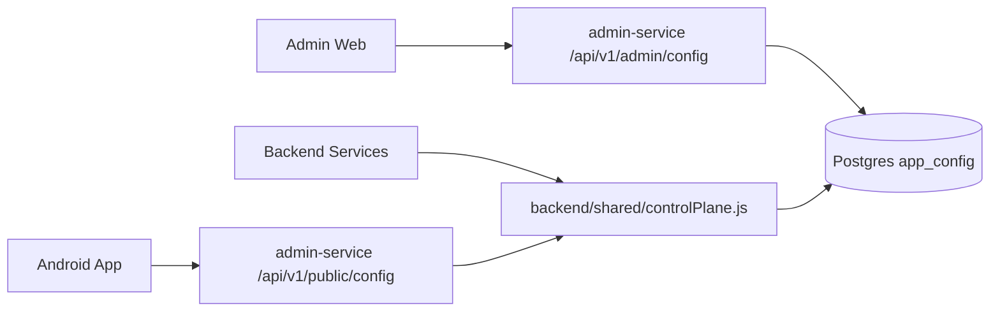

# SoulMatch Runtime Config Control Plane

SoulMatch uses admin-managed runtime config for behavior that should change without a new Android release. This document explains where config lives, how it flows, and how to add new configurable features safely.

## Current Flow

## Public Vs Private Config

| Config Type | Visible To Android | Example | Rule |
| --- | --- | --- | --- |
| Public product config | Yes | branding, navigation, monetization, safety cards, feature flags | Safe to show to users. |
| Service config | Backend only | payment gateway enabled, internal feature gates | Never expose secrets or internal routes. |
| Operations config | No | WAF mode, BFF enabled, storage provider, queue provider | Kept private for infrastructure planning. |

The private operations section is intentionally not returned by the public runtime config endpoint.

## Main Files

| File | Responsibility |
| --- | --- |
| `backend/shared/controlPlane.js` | Default config, normalization, public config projection, schema helpers. |
| `backend/shared/configSchemas/*.json` | Allowed shape for each config section. |
| `admin-web/src/context/RuntimeConfigContext.js` | Admin web config loading and state. |
| `admin-web/src/api/adminApi.js` | Admin config API calls. |
| `admin-web/src/pages/DashboardPage.js` | Current CMS/config editing UI. |
| `android/app/src/main/java/com/soulmatch/app/data/api/ApiService.kt` | Runtime config API binding. |
| `android/app/src/main/java/com/soulmatch/app/ui/viewmodels/*` | Screen-level usage of config values. |

## Existing Config Sections

| Section | Purpose | Schema File |
| --- | --- | --- |
| `branding` | App name, theme labels, brand copy | `branding.json` |
| `theme` | UI theme tokens exposed to clients | `theme.json` |
| `navigation` | Bottom menu / screen navigation switches | `navigation.json` |
| `monetization` | Member and agent plans, limits, entitlement values | `monetization.json` |
| `features` / `feature_flags` | Feature availability switches | `features.json`, `feature_flags.json` |
| `content` | CMS content cards and safety/merchandising copy | `content.json` |
| `assisted_matchmaking` | SoulMatch Assist controls | `assisted_matchmaking.json` |
| `notification_templates` | Push/inbox copy templates | `notification_templates.json` |
| `legal` | Policy version and legal URLs | `legal.json` |
| `maintenance` | Maintenance mode and minimum supported app version | `maintenance.json` |
| `client_integrations` | Client-facing integration metadata | `client_integrations.json` |
| `admin_roles` | Role definitions and permission config | `admin_roles.json` |
| `operations` | Private architecture placeholders | `operations.json` |

## Adding A New Configurable Feature

Use this sequence for all future admin-configurable behavior.

1. Add a safe default in `backend/shared/controlPlane.js`.
2. Add or update the JSON schema in `backend/shared/configSchemas/`.
3. Decide if the config is public or private.
4. If public, include only non-sensitive fields in the public config projection.
5. Add admin UI to edit it in `admin-web`.
6. Add backend enforcement if it affects entitlement, privacy, payment, verification, chat, or profile visibility.
7. Add Android UI usage only after backend behavior is enforced.
8. Add tests for config validation and the affected service behavior.
9. Update `docs/MODULE_OWNERSHIP_MAP.md` if the feature creates a new module or screen.

## Feature Examples

| Requirement | Config Section | Backend Enforcement Needed | Android Usage |
| --- | --- | --- | --- |
| Show upgrade ad every N best-match cards | `content` or `monetization` | No, unless click unlocks paid API | Best matches feed renderer. |
| Change Bronze contact unlock limit | `monetization` | Yes, `memberEntitlements.js` and profile contact API | Upgrade page and contact unlock UI. |
| Add a Safety Center tile | `content` | No, unless it affects report/block API | Safety Center screen. |
| Enable maintenance mode | `maintenance` | Yes, public config endpoint and service middleware if needed | Maintenance screen. |
| Switch to blob storage later | `operations` + service env | Yes, media adapter | No direct Android change if signed URLs stay same. |

## Do Not Put Secrets In Config

Never store raw secrets in `app_config` or public runtime config:

- Twilio auth token
- Razorpay secret
- Firebase private key
- SSH keys
- database passwords
- JWT secrets
- internal service secrets

Store secrets in environment variables or a secret manager. The admin console may show whether a key is configured, but must not show the value.

## Validation Checklist

Before shipping a config change:

1. Schema accepts the intended value.
2. Schema rejects an invalid value.
3. Public endpoint does not include private fields.
4. Android has a safe fallback if config cannot load.
5. Backend still enforces paid/private behavior even if Android is modified.

