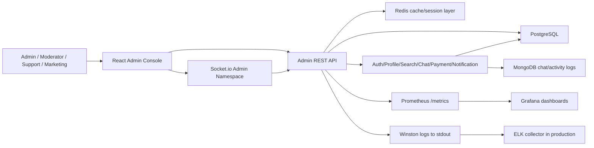
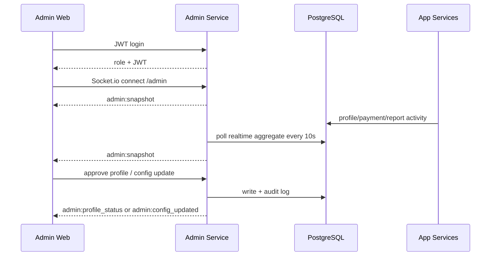
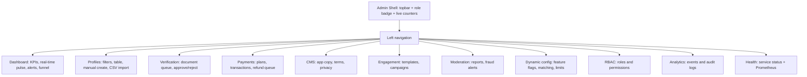

# SoulMatch Admin Console Architecture

## Scope

This control panel is designed for a matrimony platform at India scale. It supports real-time monitoring, profile operations, KYC workflows, payments, CMS, engagement campaigns, moderation, dynamic configuration, RBAC, analytics, and observability.

## System Architecture



## Real-Time Event Flow



## Database Schema Additions

Admin-specific tables and columns are in [003_admin_console.sql](../database/migrations/003_admin_console.sql).

- `profiles.verification_status`: pending, verified, rejected.
- `profiles.admin_status`: active, suspended, rejected.
- `profiles.moderation_score`: future ML/fraud signal score.
- `admin_audit_logs`: immutable admin action trail.
- `admin_alerts`: fraud, abuse, spikes, and system warnings.
- `admin_campaigns`: push/email/SMS campaign drafts.

Core platform tables used:

- `users`, `profiles`, `physical_details`, `education_career`, `family_details`, `lifestyle_details`
- `verifications`, `reports`, `subscriptions`, `transactions`
- `analytics_events`, `app_config`, `landing_pages`, `referral_codes`

## API Surface

Detailed OpenAPI draft lives at [admin-console-openapi.yaml](./admin-console-openapi.yaml).

Primary route groups:

- `POST /api/v1/admin/login`
- `GET /api/v1/admin/dashboard`
- `GET /api/v1/admin/realtime/snapshot`
- `GET|POST|PUT|DELETE /api/v1/admin/profiles`
- `POST /api/v1/admin/profiles/bulk`
- `PUT /api/v1/admin/profiles/{id}/status`
- `GET /api/v1/admin/verifications`
- `PUT /api/v1/admin/verifications/{id}/approve`
- `PUT /api/v1/admin/verifications/{id}/reject`
- `GET /api/v1/admin/payments`
- `POST /api/v1/admin/payments/refunds`
- `GET /api/v1/admin/moderation/reports`
- `GET /api/v1/admin/alerts`
- `PUT /api/v1/admin/alerts/{id}/ack`
- `GET|PUT /api/v1/admin/config/{key}`
- `POST /api/v1/admin/campaigns`
- `GET /api/v1/admin/audit-logs`
- `GET /api/v1/admin/roles`

## UI Wireframe



## RBAC

Roles:

- `super_admin`: full access.
- `admin`: operations, payments, CMS, config, analytics.
- `moderator`: profiles, verification, moderation, analytics.
- `support_agent`: profile support and read-only moderation.
- `marketing_manager`: CMS, engagement, analytics.

The admin JWT includes `role` and `permissions`; the React UI hides tabs by role, while API middleware enforces admin authentication.

## Dynamic Configuration

Stored in `app_config` and served through:

- Private admin API: `/api/v1/admin/config`
- Public runtime API: `/api/v1/public/config`
- Socket event: `admin:config_updated`

Config sections:

- `feature_flags`
- `matching`
- `registration`
- `security`
- `localization`
- `monetization`
- `notification_templates`
- `content`
- `legal`

## Deployment

Development:

```bash
cd docker
docker compose -f docker-compose.dev.yml up --build
```

Services:

- Admin web: `http://localhost:3000`
- Admin API: `http://localhost:3011`
- Prometheus: `http://localhost:9090`
- Grafana: `http://localhost:3030` with `admin/admin`

Required admin env:

```env
ADMIN_EMAIL=admin@soulmatch.app
ADMIN_PASSWORD=change_this_admin_password
ADMIN_ROLE=super_admin
ADMIN_JWT_SECRET=admin_separate_secret_key_change_this
ADMIN_REALTIME_INTERVAL_MS=10000
```

Production guidance:

- Run PostgreSQL with automated PITR backups and read replicas.
- Keep Redis in clustered mode for sessions/counters.
- Route admin traffic behind WAF, IP allowlist, TLS, and SSO/OAuth.
- Export Winston logs to ELK/OpenSearch.
- Scrape `/metrics` with Prometheus and alert in Grafana/Alertmanager to Slack/email.
- Store uploads in S3-compatible storage with signed URLs.
- Use multi-region read replicas for India-heavy traffic and keep writes in a primary region.

## Scalability Notes

- Dashboard aggregates should move to materialized views or Redis counters at 1M+ users.
- Socket.io can scale horizontally with Redis adapter.
- Analytics events can move to Kafka before Postgres/warehouse ingestion.
- Profile search should use OpenSearch/Elasticsearch for high-cardinality filters.
- Admin audit logs should be append-only with retention policies.
