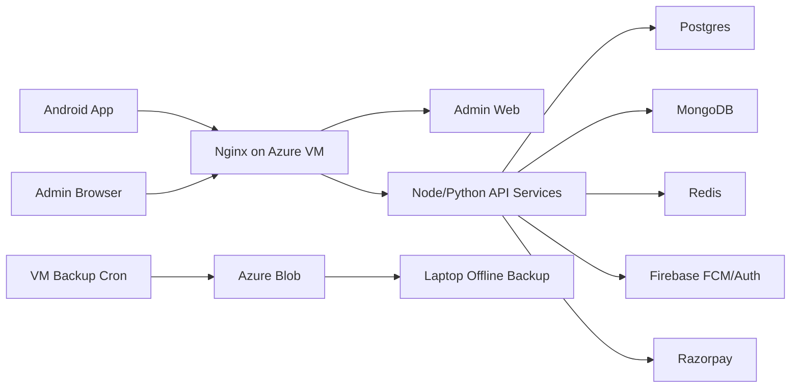
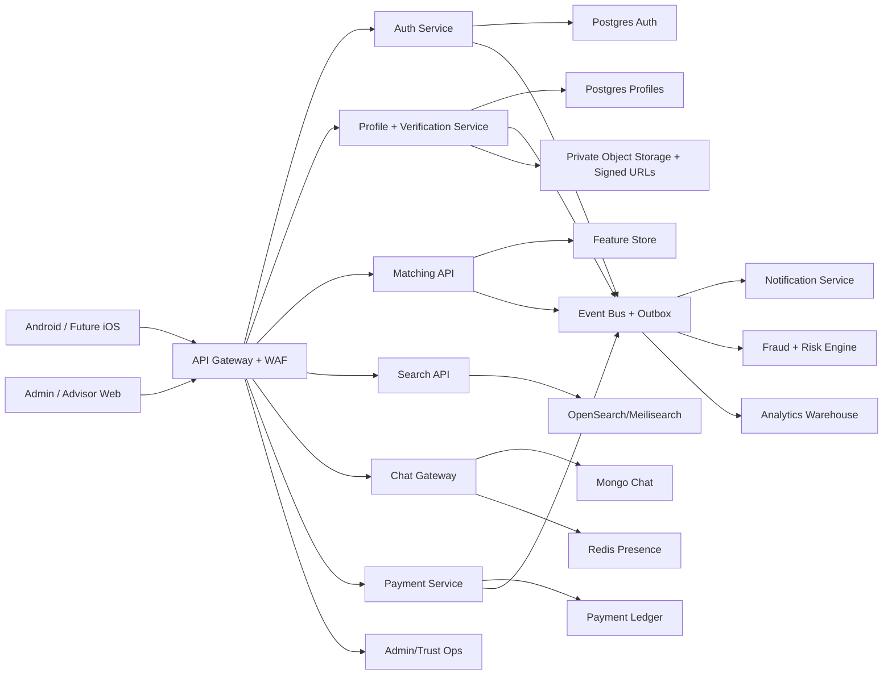

# SoulMatch Market-Ready Transformation Plan

Date: 2026-05-03

Purpose: turn SoulMatch from a working matrimony application into a high-trust, market-ready platform that can compete with Shaadi, BharatMatrimony, Jeevansathi, and newer AI-assisted matchmaking products.

## Executive Verdict

SoulMatch is no longer only a prototype. It has a deployed multi-service backend, Android app, admin web, Firebase login/distribution, backup/recovery, profile verification foundation, advisor/assisted-match foundation, partner preference flow, photo privacy request flow, audit logging, payment foundation, notifications, chat foundation, and CI/CD.

But it is not yet market-ready against major matrimony leaders. The biggest gaps are not "more screens"; the biggest gaps are trust depth, real verification operations, high-quality matching, reliable communication workflows, production-grade QA, fraud prevention, and a differentiated assisted matchmaking engine.

Current product readiness score after the 2026-05-03 market-readiness implementation: 74/100

Target for launch: 90/100

## 2026-05-03 Implementation Update

This release moves several differentiators from planning into working product foundations:

- Trust Score v2 now combines phone, Firebase/Google identity, profile completion, photos, admin/document/education/income/family verification, safety reports, active status, and recent activity.
- Trust explanations are now returned by the profile APIs and shown on cards, profile detail, and my profile.
- Seriousness Score is now calculated separately from Trust Score for internal ranking and future badges.
- Admin verification queue now shows trust score, approved proof types, and open safety report count.
- Verified-only discovery is wired across best matches and backend recommendation/search filters.
- Family Decision Board v2 now supports family votes, comments, next-step status, and audit/notification records.
- Chat safety is stronger: inactive, banned, blocked, heavily reported, and non-mutual profiles are restricted from chat.
- Message reporting and abusive-text placeholder flags are now in place for future moderation.
- Monetization gates for Verified Plus, Family Assist, Advisor Assisted, Spotlight, and Contact Unlock are configured in the DB.

## Phase Status Summary

| S.No | Phase | Status | Honest CTO Notes |
|---:|---|---|---|
| 1 | Current State Analysis | Completed | Codebase, infra, DB, security, UX, and product gaps have been audited. Needs refresh after every major release. |
| 2 | Competitor Benchmarking | Completed | Baseline comparison done against Shaadi, BharatMatrimony, Jeevansathi, and AI-assisted dating/matchmaking expectations. |
| 3 | User Pain Point Simulation | Completed | Personas and journey friction points identified. Needs live user interviews later. |
| 4 | Product Reinvention | In Progress | Trust Score v2, verified-only discovery, Family Decision Board v2, and safe chat foundations are implemented. AI depth and advisor marketplace UX still need build-out. |
| 5 | Tech Architecture Review | In Progress | Service split and deployment exist. Need gateway, event bus/outbox, stronger auth, search/indexing, and AI recommendation pipeline. |
| 6 | DevOps and Deployment | In Progress | CI/CD, Azure VM deploy, backup, restore, local recovery sync are working. Need staging env, observability, container registry, rollback. |
| 7 | QA and Testing Strategy | In Progress | Added focused trust/seriousness tests, JS/Python syntax checks, and Android compile validation. Still need API, E2E, security, and load suites. |
| 8 | Monetization and Business Model | In Progress | Ethical feature gates now exist in config. Need complete entitlement enforcement, plan UX, guarantees, trial strategy, and refund flows. |
| 9 | Iterative Improvement Loop | Started | Readiness scoring started. Must become a monthly release discipline. |
| 10 | Final Market-Ready Output | In Progress | Blueprint exists in this document. Final status remains blocked until readiness score reaches 90+. |

## Phase 1: Current State Analysis

### Implemented Today

- Android app: login, profile wizard, dashboard, search, best matches, interests, favorites/shortlists, chat foundation, subscription screen, settings, profile detail, safety/help/success/astrology/spotlight pages.
- Backend services: auth, profile, matching, search, chat, notification, payment, admin.
- Databases: Postgres for core business data, MongoDB for chat, Redis for cache/session support.
- Trust foundations: OTP/Firebase mobile login, profile verification request flow, profile status active/inactive, profile-created-by self/mediator, photo access request/approve/decline, user profile change audit logs.
- Assisted foundation: advisor tables, service areas, assisted profile assignment events, admin assist panel foundation.
- 2026-05-03 implementation update: trust scoring API fields, trust UI badges, explainable match reasons, family decision board APIs/screen, and blocked-chat hardening have been added.
- DevOps: Docker Compose production deployment, Azure VM, GitHub Actions, Firebase App Distribution, backups, restore, local recovery packages.

### Critical Gaps

| Gap | Severity | Business Impact | Required Fix |
|---|---|---|---|
| Verification is not yet a complete operations product | High | Users will not trust unknown profiles, especially women and parents. | Trust Score v2 and admin review signals are implemented; still add document upload expiry, reviewer evidence, fraud flags, and SLA queues. |
| Matching is still basic | High | Users will churn if suggestions feel random or repetitive. | Build explainable compatibility engine using preferences, behavior, dealbreakers, lifestyle, family, astrology, and response quality. |
| Chat safety and relationship flow incomplete | High | Scam, harassment, and ghosting risk. | Mutual-interest, block, inactive, banned, reported-user, report-message, and placeholder text flags are implemented; still add receipts, media safety, escalation SLAs, and structured call flow. |
| Real production QA is thin | High | Regressions will hit users after each release. | Add automated API, Android E2E, backend integration, payment, notification, and load tests. |
| Admin ops are broad but not fully operational | High | Verification/fraud/support will fail at scale. | Build queues, SLAs, fraud flags, reviewer notes, decision audit, escalation. |
| Search/match scale depends on relational queries | Medium | Slow at higher user volume. | Add OpenSearch/Meilisearch or Postgres search indexes first, then ML ranking pipeline. |
| Monetization value is not proven | Medium | Users may feel paywalled, not helped. | Sell trust, assisted matchmaking, and high-intent introductions, not only contact unlocks. |

### Why Users May Abandon

- They see few real profiles or repeated profiles.
- They cannot understand why a match is recommended.
- Photos look locked or default too often without clear flow.
- Verification badge does not yet mean enough.
- Parents do not have a guided family workflow.
- Premium value is unclear unless it creates real outcomes.
- Women may worry about privacy, screenshots, unsolicited contact, and misuse.

## Phase 2: Competitor Benchmarking

### Feature Comparison

| Feature | SoulMatch Today | BharatMatrimony | Shaadi | Jeevansathi | Gap |
|---|---|---|---|---|---|
| Phone verification | Firebase/OTP foundation | Strong phone verification positioning | Verified phone controls | Phone verification and screening | SoulMatch needs visible verified-contact trust rules. |
| Photo privacy | Request/approve foundation | Privacy controls | Photo/privacy controls | Photo protection | SoulMatch has a good start; needs signed URLs and screenshot deterrence. |
| Document verification | Workflow foundation | Matrimony Stamp style documents | Verification/safety posture | Govt ID verification claim in app listing | SoulMatch needs document upload, review, expiry, and trust-score display. |
| Assisted matchmaking | Advisor data model started | Dedicated relationship manager | Premium assistance/select services | Relationship/exclusive services | SoulMatch can win by making advisor allocation measurable and hyperlocal. |
| Video/voice | Not mature | Meeting/support workflows | Video calling benefits | Voice/video calling and video profiles | SoulMatch needs safe in-app calling or structured family call scheduling. |
| AI compatibility | Not real yet | Mostly filters + human service | Mostly filters + premium ranking | Filters + events/video profile | SoulMatch can differentiate with explainable compatibility. |
| Admin/fraud ops | Foundation | Mature operations | Mature operations | Mature operations | SoulMatch needs operational depth before public scale. |

### Opportunities to Stand Out

1. Trust score visible on every profile.
2. Explainable match reasons: "why this person fits".
3. Verified-only mode for serious users.
4. Family decision board: shortlist, notes, call outcome, next step.
5. Hyperlocal advisor allocation based on pincode, language, community, workload, and advisor success rate.
6. Low-ghosting protocol: accept, schedule, respond, close politely.
7. Outcome-based monetization: pay for assisted progress, not vague access.

## Phase 3: User Pain Point Simulation

### Male, 25-35, IT Professional

Journey: mobile login -> profile completion -> search -> interest -> chat -> family discussion.

Friction:

- Wants fewer better matches, not endless browsing.
- Needs confidence that the other person is serious.
- May abandon if interests do not get responses.

Fix:

- Daily curated "Top 7 serious matches".
- Response probability indicator.
- Explainable compatibility and dealbreaker checks.
- Advisor-assisted option for busy users.

### Female, 23-30, Working Professional

Journey: login -> privacy setup -> verify -> browse -> accept/decline -> chat.

Friction:

- Highest fear: misuse, fake profiles, unsolicited contact, family pressure.
- Photo privacy must be clear and respected.
- Needs strong block/report and safe chat.

Fix:

- Default privacy-first onboarding.
- Verified-only inbox.
- Photo request approval with audit.
- Safety center actions visible on every profile.

### Parents Managing Profile

Journey: create child profile -> set preferences -> verify documents -> shortlist -> call family.

Friction:

- Parents need simpler language and guided actions.
- They need trust proof, not dating-style UI.
- They want family notes and next-step reminders.

Fix:

- Parent/family role mode.
- Family shortlist board.
- "Call scheduled / spoken / rejected / pending" status.
- Advisor handoff for premium families.

### NRI Users

Journey: register from abroad -> verify identity -> location/community preference -> family coordination.

Friction:

- Time zones, trust, document verification, and family involvement.
- Needs in-app video/voice and safe scheduling.

Fix:

- NRI verification flow.
- Time-zone-aware scheduling.
- Family contact privacy.
- Region/community-based recommendations.

## Phase 4: Product Reinvention

### Core Differentiation

SoulMatch should not be "another profile browsing app".

Recommended positioning:

SoulMatch = trusted, explainable, family-aware matchmaking with optional verified advisors.

### Unique Features to Build

| Feature | Status | Why It Matters |
|---|---|---|
| Trust Score | In Progress | Trust Score v2 is implemented with explainability; still needs richer document evidence and admin reviewer proof screens. |
| Explainable Compatibility | Not Started | Users trust suggestions when reasons are clear. |
| Verified-Only Mode | In Progress | Backend and Android best matches support verified-only mode; search UI parity and saved preferences should be completed next. |
| Photo Request and Approval | In Progress | Recently implemented foundation. Needs polish and signed URLs. |
| Profile Change Audit | In Progress | Recently implemented. Needs admin viewer/export. |
| Advisor-Assisted Matchmaking | In Progress | Data model and admin controls exist. Needs standalone advisor login, payment, queues, SLAs. |
| Family Decision Board | In Progress | Family votes, comments, statuses, reminders, and Android UI are implemented; comparison view needs richer side-by-side UX. |
| Anti-Ghosting Protocol | Not Started | Reduces user frustration and increases success rate. |
| Compatibility Interview | Not Started | Captures values, expectations, family views, lifestyle. |

## Phase 5: Tech Architecture Review

### Current Architecture

### Target Architecture

### Migration Strategy

1. Keep Azure VM until usage proves demand.
2. Add API gateway and internal service auth.
3. Add outbox table and background worker before Kafka.
4. Move photos to private object storage with signed URLs.
5. Add search index for profiles.
6. Add AI recommendation service after enough data exists.
7. Move to Kubernetes only after VM limits are real.

## Phase 6: DevOps and Deployment

### Current Status

- GitHub Actions exists.
- Azure VM production deploy works.
- Docker Compose production works.
- Migration script repaired.
- VM backup, Azure Blob upload, laptop sync, and recovery package scripts exist.
- Cloud/local sync checker exists.

### Required Before Public Launch

- Separate `dev`, `staging`, and `prod`.
- Container registry with immutable image tags.
- Rollback to previous image.
- Central logs.
- Metrics per service.
- Error tracking.
- Alerting for health, latency, disk, memory, failed OTP, payment failure, notification failures.
- Monthly restore drill.

## Phase 7: QA and Testing Strategy

### Current Status

Started only. Current tests are not enough for public launch.

### Minimum Test Suite

| Test Area | Required |
|---|---|
| Auth | Firebase login, existing user login, duplicate phone, token refresh, logout |
| Profile | Create, edit, audit log, status active/inactive, photo upload/delete/privacy |
| Match | 15+ results, filters, inactive hidden, blocked hidden, privacy honored |
| Interest | Send, accept, decline, resend after decline, notification triggers |
| Chat | Only mutual accepted users can chat, history auth, block/report |
| Verification | Request, document upload, admin approve/reject, badge display |
| Payment | Order, success, failed payment, webhook, duplicate webhook, refund |
| Notification | FCM token save, interest notification, photo request, decline/accept |
| Security | Rate limits, SQL injection, auth bypass, file upload abuse |
| Load | 1K, 10K, 100K profile search/match simulations |

## Phase 8: Monetization and Business Model

### Ethical Monetization Principle

Users should pay because SoulMatch improves trust and match success, not because the app blocks basic dignity.

### Recommended Plans

| Plan | Price Direction | Value |
|---|---|---|
| Free | Free | Create profile, verify, basic search, limited interests |
| Trust Plus | Low monthly | Verified-only search, profile visitors, higher privacy controls |
| Family Plus | Mid | Family board, shared shortlist, scheduled calls, priority support |
| Assisted | High | Human advisor support, curated shortlist, family coordination |
| Advisor Membership | B2B | Verified advisors pay for local assisted profile allocation |

### Avoid

- Fake urgency.
- Selling contact details without privacy clarity.
- Unlimited low-quality interests.
- Pushing users to pay before proving profile quality.

## Phase 9: Iterative Improvement Loop

### Current Readiness Score

| Dimension | Score |
|---|---:|
| Core app functionality | 70 |
| Trust and safety | 68 |
| Match quality | 52 |
| UX polish | 70 |
| Scalability | 60 |
| QA maturity | 45 |
| DevOps/recovery | 75 |
| Monetization clarity | 62 |

Overall: 74/100

### Iteration Loop

1. Release one capability.
2. Test with real users.
3. Measure drop-off, trust, response rate, and match progression.
4. Fix the biggest blocker.
5. Re-score.

### Readiness Gates

- 70: internal alpha
- 80: trusted beta with limited real users
- 90: market-ready public launch
- 95: scalable growth-ready

## Phase 10: Final Market-Ready Output

### Final Feature Set Required

- Verified profile ecosystem.
- Trust score and proof badges.
- Explainable compatibility.
- Strong privacy/photo controls.
- Real chat with safety controls.
- Interest lifecycle with notifications.
- Family decision workflows.
- Advisor-assisted matchmaking.
- Admin trust operations.
- Payment and subscription lifecycle.
- Backup, restore, monitoring, CI/CD.

### USP

SoulMatch helps serious families and serious singles find trustworthy, compatible matches through verified profiles, explainable recommendations, privacy-first communication, and optional local advisor support.

### Go-To-Market Strategy

1. Start hyperlocal: one city or one community.
2. Make all initial profiles manually verified.
3. Use advisor-assisted matching as the wedge.
4. Publish trust and safety as the brand promise.
5. Charge for outcomes and support, not just access.
6. Collect success stories aggressively.
7. Expand city by city after operational quality is stable.

## Immediate Next Build Priorities

| Priority | Work Item | Status |
|---:|---|---|
| 1 | Trust Score backend + UI badge | Completed foundation |
| 2 | Verification admin queue hardening | In Progress |
| 3 | Family Decision Board | Completed foundation |
| 4 | Explainable match reasons | Not Started |
| 5 | Advisor login + allocation dashboard | In Progress |
| 6 | Chat safety hardening | In Progress |
| 7 | API/E2E test automation | Started |
| 8 | Staging environment | Not Started |

## Non-Negotiables Before Public Launch

- No mock/demo profiles in production user journeys.
- No public unprotected service endpoints.
- No plain file secrets in Git.
- No profile photo exposure without privacy enforcement.
- No payment success without webhook verification.
- No admin action without audit trail.
- No production launch without restore drill.
- No "verified" badge unless verification has proof.
