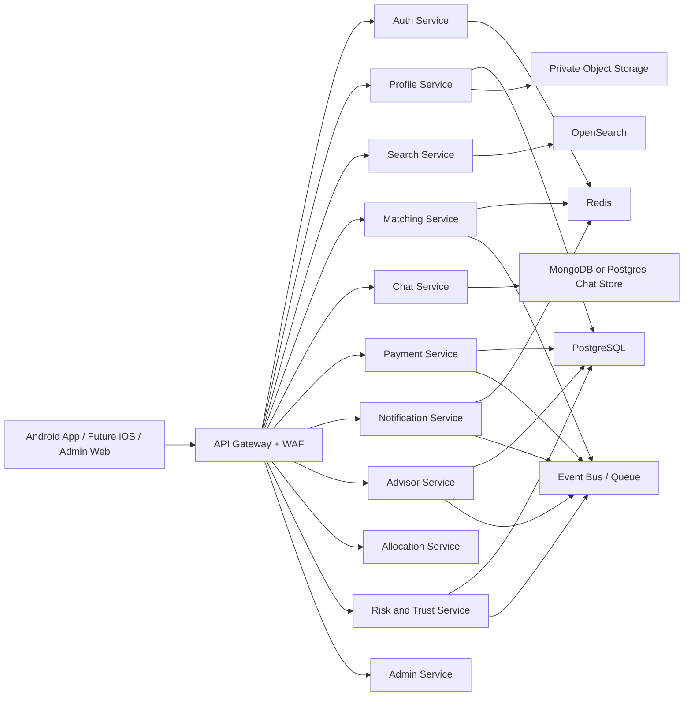

# SoulMatch Product Strategy and Market Differentiation

Last updated: 2026-05-03
Owner intent: build SoulMatch into a trusted, useful, commercially strong matrimony platform that is clearly different from BharatMatrimony, Shaadi.com, Jeevansathi, and local marriage bureaus.

## 1. Executive Summary

SoulMatch should not try to win as a smaller copy of existing matrimony apps. The better strategy is to become a trust-first, hyperlocal, family-aware matchmaking platform with optional assisted matchmaking through verified advisors.

The winning position is:

**SoulMatch = serious profiles + strong verification + explainable matching + local assisted matchmaking.**

That gives SoulMatch a sharper identity than:

- "one more matrimony app"
- "another profile browsing catalog"
- "a generic premium subscription app"

The biggest opportunity is to combine:

- digital matchmaking
- family collaboration
- verified profile trust
- local advisor support
- operationally measurable matchmaking outcomes

## 2. Current SoulMatch Baseline

Based on the current codebase, SoulMatch already has a meaningful foundation:

- Android app with profile creation, search, interests, notifications, payments, chat foundation, and admin-aware flows
- Firebase phone-auth login path
- profile verification workflow
- partner preference flow
- spotlight, astrology, safety center, help and support, success stories pages
- profile active or inactive controls
- profile created by `self` or `mediator`
- admin console
- backend service split for auth, profile, search, matching, chat, notifications, payments, and admin

This means SoulMatch is already moving in the right direction. It is no longer just a demo concept. The question now is how to shape it into a market-worthy product.

## 3. Competitor Landscape

The large matrimony platforms broadly compete on five things:

- profile inventory size
- trust and verification
- privacy and communication unlocks
- premium or assisted matchmaking
- regional and family relevance

### 3.1 Market Comparison

| Area | SoulMatch Today | BharatMatrimony | Shaadi.com | Jeevansathi / similar apps | Opportunity for SoulMatch |
|---|---|---|---|---|---|
| Trust | OTP, verification flow, safety center, moderation foundation | Strong verification language, assisted service, document trust markers | Strong privacy, premium safety and communication positioning | Verification, calls, chat, filters | Make trust operational and visible, not just marketing copy |
| Assisted matchmaking | Early foundation through mediator-created profiles | Strong relationship-manager model | Assisted and service-center style support | Mixed assisted support | Build a better advisor-led flow from the start |
| Hyperlocal workflows | Not built yet | Regional network strength | Strong brand, but not hyperlocal by design | Community and location-heavy usage | Hyperlocal advisor allocation can become a moat |
| Matching quality | Good foundation, still early | Large inventory with broad filters | Large inventory with premium prioritization | Strong practical filtering | Optimize for fewer better introductions, not endless browsing |
| Family involvement | Partial | Strong | Strong | Strong | Make family collaboration first-class |
| Monetization | Plans, spotlight, payment foundation | Premium, assisted, higher-touch packages | Premium, spotlight, communication unlocks | Premium + community trust | Package trust and assisted value, not only contact access |

## 4. SoulMatch Strategic Position

SoulMatch should be positioned as:

**The trusted assisted matrimony platform for serious singles and serious families.**

That position is stronger than competing only on:

- price
- number of profiles
- advanced filters
- astrology alone

### 4.1 What SoulMatch should stand for

SoulMatch should become known for:

1. Trusted profiles
2. Better quality introductions
3. Family-sensitive workflows
4. Privacy-first communication
5. Verified local matchmaking advisors

### 4.2 What SoulMatch should avoid becoming

SoulMatch should avoid becoming:

- a low-trust lead marketplace
- an endless swipe or browse app
- a paywall-only business with poor outcomes
- a generic app with weak identity

## 5. Core Differentiators to Build

### 5.1 Trust should be the product

Every serious matrimony user worries about:

- fake profiles
- hidden marital history
- financial scams
- bad-intent contacts
- profile misuse
- low-seriousness users

Trust should therefore be a product pillar, not a support function.

#### Trust layers recommended

1. Phone verified
2. Email verified
3. Selfie verified
4. Govt ID verified
5. Education verified
6. Employment verified
7. Family reference verified
8. Advisor-reviewed
9. Community or local reference verified

#### Trust UX recommendation

Every profile should show:

- verification level
- when verified
- by whom
- whether profile is self-created or advisor-created
- whether photos are verified
- activity freshness

#### Trust score recommendation

Create a visible `Trust Score` made from:

- identity completeness
- document verification
- activity quality
- response behavior
- complaint history
- family confirmation
- advisor rating, if assisted

### 5.2 Assisted matchmaking through verified advisors

This is one of SoulMatch's strongest possible differentiators.

Do not use the word "broker" in the product. It sounds transactional and weakens trust.

Use:

- Advisor
- Match Advisor
- Relationship Advisor
- Assisted Match Partner

#### Advisor role

The advisor should:

- manage assisted-member queues
- help complete and improve profiles
- create mediated profiles where needed
- speak with families
- shortlist relevant matches
- coordinate first communication
- schedule family calls or meetings
- record outcomes and follow-ups

#### Who uses assisted mode

Assisted mode is especially useful for:

- busy professionals
- parents managing child profiles
- users in smaller cities
- users who prefer family-led screening
- premium members seeking higher quality support

### 5.3 Hyperlocal matchmaking allocation

Your "cab-style nearest assignment" idea is strong, but it should not be based on nearest address alone.

Unlike a cab, a matrimony profile should be assigned using a weighted score.

#### Recommended advisor allocation score

Use a weighted model like:

`allocation_score = locality_fit + language_fit + community_fit + trust_score + advisor_success_score + advisor_availability - overload_penalty - complaint_penalty`

#### Recommended allocation inputs

- pincode proximity
- city and district proximity
- language match
- religion and community capability
- advisor gender preference fit, if required
- advisor active workload
- advisor SLA score
- advisor complaint rate
- advisor conversion success
- premium plan priority

#### Important rule

Profiles should never be openly exposed to all nearby advisors.

Advisor access should only happen when:

- the member opted into assisted matchmaking, or
- the family requested advisor support, or
- the admin triggered an assisted workflow

This prevents SoulMatch from becoming a low-trust profile marketplace.

### 5.4 Matchmaking should optimize for decisions, not browsing

Many matrimony apps keep users busy, not successful.

SoulMatch should focus on decision quality:

- best introductions this week
- why these profiles were recommended
- what step should happen next
- who needs to respond
- what blocked progress

#### Match explanation examples

- Education and career fit
- Family preference fit
- Lifestyle fit
- Community and location fit
- Recent activity
- Similar partner preference goals
- Verified family involvement

This allows SoulMatch to say:

**"We do not just show profiles. We help families move toward the right decision."**

### 5.5 Family collaboration should be first-class

In the Indian matrimony market, marriage decisions are often not individual-only.

SoulMatch should support:

- member account
- parent or guardian collaborator
- family shortlist
- private family notes
- internal family status
- advisor-family coordination
- family-approved contact unlocks

## 6. Recommended Product Modes

SoulMatch should support three clear modes:

### 6.1 Self-Service Mode

For independent users who want to:

- search
- shortlist
- send interests
- chat directly

### 6.2 Family-Assisted Mode

For families who want to:

- co-manage profile
- review matches
- keep notes
- respond together

### 6.3 Advisor-Assisted Mode

For premium or assisted users who want:

- a verified local advisor
- curated shortlists
- guided follow-up
- meeting coordination

This three-mode structure creates a more powerful business model than simple free versus premium plans.

## 7. Recommended Membership Model

### 7.1 Member packages

#### Free

- create profile
- basic search
- limited interests
- limited profile visibility

#### Plus

- advanced filters
- more interests
- recent viewers
- shortlist and notes

#### Premium

- contact unlocks
- hidden photo access
- spotlight visibility
- chat and communication extras

#### Verified Premium

- premium benefits
- trust verification package
- stronger visibility in trusted pools

#### Assisted Premium

- assigned advisor
- curated shortlist
- family follow-up support
- meeting coordination

#### Elite

- high-touch private service
- relationship manager style support
- stronger privacy protections

### 7.2 Advisor packages

Avoid giving unrestricted full-area access to profiles.

Recommended advisor monetization:

- onboarding fee
- KYC approval fee
- monthly professional seat fee
- assisted allocation tier
- lead credits or bandwidth limits
- success-based payout or commission
- suspension or downgrade based on complaint rate

## 8. Product Features That Should Make SoulMatch Stand Out

### 8.1 Trust and safety features

- multi-layer verification
- visible trust score
- private photo vault
- screenshot-sensitive photo protections where feasible
- profile authenticity review
- scam behavior detection
- complaint and appeal workflows
- emergency report and block
- advisor abuse detection

### 8.2 Match-quality features

- explainable compatibility
- family-fit score
- lifestyle-fit score
- seriousness score
- response-likelihood score
- duplicate-profile suppression
- recency and intent scoring

### 8.3 Advisor-assisted features

- advisor service areas
- advisor specialties by community and language
- advisor lead inbox
- advisor notes
- task list and reminders
- family coordination timeline
- advisor performance scorecard

### 8.4 Family features

- parent collaborator login
- family note system
- internal review states
- shared shortlist
- family-only reminders
- advisor-family escalation

### 8.5 Useful premium features

- spotlight and premium ranking
- priority response nudges
- secure scheduled calls
- voice introduction options
- premium support
- private browsing modes

## 9. Recommended Experience Architecture

### 9.1 Consumer app experience

1. Welcome and login
2. Identity and profile setup
3. Partner preferences
4. Verification hub
5. Search and recommendations
6. Interests and responses
7. Chat and guided next steps
8. Family review layer
9. Membership and spotlight
10. Help, safety, and support

### 9.2 Advisor experience

1. Advisor onboarding and KYC
2. Define service areas
3. Define communities, languages, and capacity
4. Receive assisted allocations
5. Review profile quality
6. Shortlist candidates
7. Coordinate family communication
8. Schedule meetings
9. Update outcomes
10. Track performance and payouts

### 9.3 Admin experience

1. Profile moderation
2. Verification approval and rejection
3. Advisor approval and suspension
4. Risk and fraud dashboard
5. Complaint and abuse workflows
6. Allocation controls
7. Payment and refund visibility
8. SLA and operations analytics

## 10. Technical Architecture Direction

SoulMatch already has a good starting service split. The next evolution should add dedicated services for advisor operations, trust, and allocation.

### 10.1 Recommended service map

- `auth-service`
- `profile-service`
- `search-service`
- `matching-service`
- `chat-service`
- `notification-service`
- `payment-service`
- `admin-service`
- `advisor-service` (new)
- `allocation-service` (new)
- `risk-trust-service` (new)
- `analytics-service` (new)

### 10.2 Recommended platform components

- PostgreSQL for core transactions
- Redis for sessions, cache, rate limits, queues
- Mongo only if chat continues to need document storage
- OpenSearch for profile discovery and ranking
- private object storage for photos and documents
- event bus or queue for notifications, fraud events, matching refresh, and audit events
- observability stack for metrics, logs, traces, and alerts

### 10.3 Recommended high-level target architecture

## 11. Database Expansion Plan

### 11.1 New core tables recommended

- `advisors`
- `advisor_kyc_documents`
- `advisor_service_areas`
- `advisor_specializations`
- `advisor_languages`
- `advisor_capacity`
- `advisor_ratings`
- `assisted_profiles`
- `assisted_assignments`
- `lead_allocations`
- `lead_allocation_events`
- `family_contacts`
- `family_collaborators`
- `family_notes`
- `match_recommendation_reasons`
- `profile_trust_scores`
- `fraud_signals`
- `verification_evidence`
- `meeting_requests`
- `meeting_outcomes`
- `advisor_payouts`
- `support_tickets`

### 11.2 Example schema direction

#### advisors

- advisor_id
- full_name
- phone
- email
- kyc_status
- active_status
- city
- state
- max_active_profiles
- average_rating
- success_rate
- complaint_score

#### advisor_service_areas

- advisor_service_area_id
- advisor_id
- country
- state
- city
- locality
- pincode
- radius_km

#### assisted_assignments

- assignment_id
- profile_id
- advisor_id
- assignment_type
- assignment_status
- assigned_at
- released_at
- release_reason

#### profile_trust_scores

- trust_score_id
- profile_id
- phone_verified
- email_verified
- selfie_verified
- govt_id_verified
- employment_verified
- family_reference_verified
- complaint_penalty
- trust_score
- computed_at

## 12. API Design Plan

### 12.1 Advisor APIs

- `POST /api/v1/advisors/onboard`
- `POST /api/v1/advisors/kyc`
- `GET /api/v1/advisors/me`
- `PUT /api/v1/advisors/service-areas`
- `PUT /api/v1/advisors/specializations`
- `GET /api/v1/advisors/assignments`
- `POST /api/v1/advisors/assignments/{id}/accept`
- `POST /api/v1/advisors/assignments/{id}/release`
- `POST /api/v1/advisors/notes`
- `POST /api/v1/advisors/meetings`

### 12.2 Assisted matchmaking APIs

- `POST /api/v1/assisted/opt-in`
- `POST /api/v1/assisted/opt-out`
- `GET /api/v1/assisted/status`
- `GET /api/v1/assisted/advisor`
- `GET /api/v1/assisted/recommendations`

### 12.3 Trust and verification APIs

- `POST /api/v1/verification/request`
- `POST /api/v1/verification/documents`
- `GET /api/v1/verification/status`
- `GET /api/v1/trust/profile/{id}`
- `POST /api/v1/safety/report`
- `POST /api/v1/safety/block`

### 12.4 Family collaboration APIs

- `POST /api/v1/family/invite`
- `GET /api/v1/family/members`
- `POST /api/v1/family/notes`
- `GET /api/v1/family/notes`
- `PUT /api/v1/family/decision`

## 13. Admin Workflow Design

### 13.1 Verification workflow

1. User requests verification
2. User uploads required evidence
3. Risk checks run
4. Admin reviews evidence
5. Admin approves, rejects, or asks for more details
6. User gets notification
7. Profile trust badge updates

### 13.2 Advisor onboarding workflow

1. Advisor creates account
2. Advisor uploads KYC and business identity details
3. Admin reviews
4. Service areas and specialties are approved
5. Advisor becomes active
6. Performance is tracked continuously

### 13.3 Complaint workflow

1. User files complaint
2. Risk score updates
3. Admin triages
4. Evidence attached
5. Profile or advisor action taken
6. Resolution and audit trail stored

### 13.4 Lead allocation workflow

1. Assisted profile enters allocation pool
2. Allocation engine scores nearby qualified advisors
3. Best advisor receives assignment
4. Assignment acceptance SLA starts
5. If not accepted, assignment re-routes
6. Family and member remain privacy-protected until approved state

## 14. KPI Framework

SoulMatch should track outcome metrics, not only top-of-funnel metrics.

### 14.1 Trust metrics

- percent verified profiles
- percent verified photos
- percent advisor-KYC-approved
- complaints per 1,000 interactions
- fraud incidents per month
- block and report resolution SLA

### 14.2 Match quality metrics

- profile completion rate
- partner preference completion rate
- time to first accepted interest
- accepted-interest rate
- chat start rate after mutual interest
- meeting scheduling rate
- family review conversion rate

### 14.3 Assisted metrics

- assisted opt-in rate
- advisor acceptance SLA
- advisor assignment utilization
- advisor conversion rate
- advisor complaint rate
- advisor success score

### 14.4 Revenue metrics

- free-to-paid conversion
- premium plan mix
- spotlight uptake
- assisted-package uptake
- revenue per successful match path
- refund rate

## 15. Six-Month Execution Roadmap

## Month 1: Production Hardening

Goal: make the current platform safe and credible enough to build on.

Deliver:

- eliminate remaining mock behavior in release paths
- complete notification persistence and read states
- close privacy enforcement gaps
- stabilize payment and webhook flows
- improve admin security and auditability
- finalize verification workflow

## Month 2: Trust Layer Release

Goal: make trust visible and measurable.

Deliver:

- trust score engine
- identity verification badges
- evidence upload pipeline
- complaint and moderation dashboard
- trusted-profile ranking factor

## Month 3: Family Collaboration Release

Goal: support real family-driven decision making.

Deliver:

- family collaborator invite
- family notes
- internal family decision state
- family shortlist tools
- family-aware notifications

## Month 4: Advisor Foundation

Goal: launch the advisor model in a controlled form.

Deliver:

- advisor onboarding
- advisor KYC
- service area mapping
- advisor dashboard
- assisted opt-in member flow

## Month 5: Hyperlocal Allocation Engine

Goal: route assisted profiles intelligently.

Deliver:

- allocation engine
- locality and specialization scoring
- workload and SLA balancing
- advisor re-assignment flow
- allocation analytics

## Month 6: SoulMatch Assist Launch

Goal: release the full differentiating assisted product in a limited geography.

Deliver:

- curated advisor-led matchmaking
- premium assisted plans
- weekly curated shortlist workflow
- meeting coordination
- advisor performance scoring

## 16. Launch Strategy

Do not attempt a broad national launch early.

Recommended first launch model:

- 1 to 2 cities
- 1 to 2 language or community clusters
- 10 to 20 verified advisors
- strict admin oversight
- very strong verification and moderation
- high quality support and success tracking

This reduces chaos and improves trust.

## 17. Go-to-Market Recommendation

### 17.1 Core positioning message

Use a message like:

**"SoulMatch helps serious singles and serious families find trustworthy, relevant, well-guided matches."**

### 17.2 Who to target first

Primary early audiences:

- urban and semi-urban professionals
- families who prefer guided help
- users tired of low-quality profile browsing
- communities that still value localized relationship networks

### 17.3 Channels

- digital acquisition
- parent and family referral campaigns
- local advisors and community connectors
- wedding ecosystem partnerships
- verified success-story marketing

## 18. Risks and How to Handle Them

### 18.1 Risk: advisor misuse or lead leakage

Mitigation:

- strict KYC
- masked contact details
- consent-based profile access
- full advisor audit logs
- complaint-led suspension

### 18.2 Risk: low-quality assisted service

Mitigation:

- advisor scorecard
- assignment caps
- SLA tracking
- rating system
- phased city-by-city rollout

### 18.3 Risk: overbuilding before trust

Mitigation:

- complete core trust and privacy first
- do not scale advisor operations until admin controls are strong

### 18.4 Risk: trying to compete on inventory too early

Mitigation:

- compete on quality, trust, and guided outcomes
- use focused launch regions

## 19. What SoulMatch Should Do Differently From Competitors

In simple terms:

### BharatMatrimony is strong at scale plus assisted services

SoulMatch should be:

- more transparent
- more explainable
- more modern operationally
- more local in allocation

### Shaadi.com is strong at premium communication and privacy framing

SoulMatch should be:

- more family-aware
- more advisor-led
- more trust-visible
- more outcome-focused

### Jeevansathi and others are strong at practical search and communication features

SoulMatch should be:

- more curated
- more guided
- more verified
- more operationally controlled

## 20. Final Strategic Recommendation

The best signature offering for SoulMatch is:

## SoulMatch Assist

This should include:

- verified profile
- verified family
- verified advisor
- locality-aware advisor assignment
- curated weekly shortlist
- privacy-first communication
- explainable match reasons
- family follow-up support

This is strong as a product, strong as a business, and hard to copy quickly if executed well.

## 21. Recommended Next Deliverables

To move from strategy to execution, the next documents or builds should be:

1. Advisor module functional specification
2. Family collaboration functional specification
3. Trust score and verification rules document
4. Allocation engine design
5. Database migration plan for advisor and assisted flows
6. API contract draft for advisor and assisted services
7. Admin workflow screens for advisor moderation and assignment control
8. Pricing and package sheet

## 22. Source Notes

This strategy uses:

- current SoulMatch codebase state
- previously created enterprise audit in the repository
- public competitor positioning reviewed on 2026-05-03 from official sites and app listings

Competitor references used:

- BharatMatrimony main site
- BharatMatrimony assisted service pages
- BharatMatrimony privacy and security pages
- Shaadi.com safety and privacy pages
- Shaadi.com membership and premium support pages
- Jeevansathi public app listing and positioning
