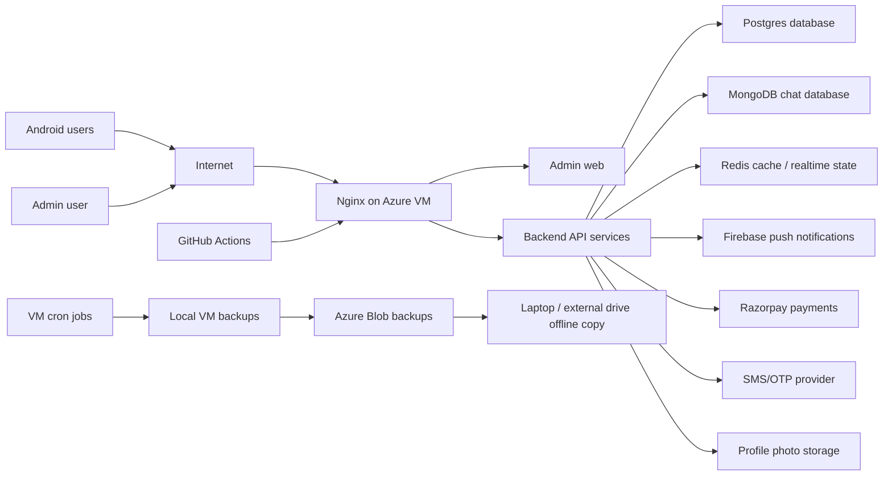

# SoulMatch System Handover

This document explains the SoulMatch app in simple language. It is meant for future you, a new developer, a DevOps engineer, or a non-coding operator who needs to understand how the system works, how it is configured, and how to move it to a new laptop, GitHub repo, or cloud server.

Important: this document does not store real secret values. It lists secret names and where they live. Do not paste real passwords, private keys, Firebase private keys, Razorpay secrets, SSH private keys, or database passwords into Git.

## 1. What SoulMatch Is

SoulMatch is a matrimony application.

It has these main parts:

| Area | What it does | Where it lives |
|---|---|---|
| Android app | App used by customers on mobile | `android/` |
| Backend APIs | Login, profile, matches, search, chat, payment, notifications, admin APIs | `backend/` |
| Admin web | Browser dashboard for owner/admin | `admin-web/` |
| Database schema | SQL tables and seed data | `database/` |
| Production Docker setup | Runs the app on the VM | `docker/docker-compose.prod.yml` |
| Automation scripts | Deploy, backup, restore, monitor, sync backups | `tools/` |
| GitHub Actions | Automatic build and deployment | `.github/workflows/soulmatch-production-deploy.yml` |
| Documentation | Runbooks and handover notes | `docs/` |

## 2. Current Important Locations

| Item | Current value |
|---|---|
| Local laptop project folder | `C:\Users\ANIRUDH\Documents\soulmatch` |
| GitHub repository | `https://github.com/krsr08/soulmatch.git` |
| Azure resource group | `soulmatch-rg` |
| Azure region | `centralindia` |
| Azure VM name | `soulmatch-vm` |
| Azure VM public IP | `20.204.142.19` |
| Azure VM user | `azureuser` |
| VM app folder | `/home/azureuser/soulmatch` |
| VM production env file | `/home/azureuser/soulmatch/docker/production.env` |
| VM local backups | `/home/azureuser/backups/soulmatch` |
| Azure backup storage account | `soulmatchbkb1bbhwbi` |
| Azure backup container | `soulmatch-backups` |
| Laptop offline backup folder | `C:\Users\ANIRUDH\Documents\soulmatch-backups` |
| Firebase project ID | `soul-match-2ead9` |
| Firebase project number | `253330028301` |
| Firebase Android app ID | `1:253330028301:android:4a4647b92b64d0ebec6244` |
| Android package name | `com.soulmatch.app` |
| Google Web OAuth client ID | `253330028301-46qp0puk1rj2nvpmoklagv4njcta6do7.apps.googleusercontent.com` |

## 3. Simple Architecture



## 4. Backend Services

The backend is split into multiple services. They run together on the VM using Docker Compose.

| Service | Port on VM | Purpose | Health check |
|---|---:|---|---|
| `auth-service` | `3001` | Login, OTP, Google Sign-In, JWT tokens | `http://127.0.0.1:3001/health` |
| `profile-service` | `3002` | User profile, photos, privacy, verification data | `http://127.0.0.1:3002/health` |
| `matching-service` | `3003` | Matches, interests, favourites, recommendations | `http://127.0.0.1:3003/health` |
| `search-service` | `3004` | Search and filtering | `http://127.0.0.1:3004/health` |
| `chat-service` | `3005` | Chat and conversations | `http://127.0.0.1:3005/health` |
| `notification-service` | `3006` | Push notification and notification APIs | `http://127.0.0.1:3006/health` |
| `payment-service` | `3007` | Subscription and Razorpay payment logic | `http://127.0.0.1:3007/health` |
| `admin-service` | `3011` | Admin APIs and control plane | `http://127.0.0.1:3011/health` |
| `admin-web` | `3000` | Admin browser UI served by Nginx container | `http://127.0.0.1:3000` |

Production exposes public traffic through Nginx, not by exposing these ports directly to the internet.

## 5. Data Storage

| Data | Current storage | Notes |
|---|---|---|
| Users, profiles, interests, payments, admin data | Postgres Docker volume | Main business database |
| Chat conversations/messages | MongoDB Docker volume | Chat database |
| Cache/session/realtime helper data | Redis Docker volume | Can usually be rebuilt, but still monitored |
| Profile uploads | Docker volume `profile_uploads` | Backed up daily |
| Backups | VM disk and Azure Blob | Also synced to laptop on demand |

## 6. Secrets and Configuration

Real secret values are not stored in this document.

### Where production secrets live

Production runtime secrets live only on the VM:

```text
/home/azureuser/soulmatch/docker/production.env
```

This file is intentionally ignored by Git.

### Where GitHub deployment secrets live

GitHub Actions secrets live in:

```text
GitHub repo > Settings > Secrets and variables > Actions
```

### Secret inventory

| Secret name | Used by | Where to store | Notes |
|---|---|---|---|
| `POSTGRES_PASSWORD` | Postgres/backend | VM `docker/production.env` | Main DB password |
| `JWT_SECRET` | Auth | VM env | Generate with `openssl rand -hex 32` |
| `REFRESH_TOKEN_SECRET` | Auth | VM env | Must be different from JWT secret |
| `ADMIN_JWT_SECRET` | Admin | VM env | Admin token signing |
| `ADMIN_PASSWORD_HASH` | Admin login | VM env | Store bcrypt hash, not plaintext password |
| `INTERNAL_SERVICE_SECRET` | Backend service-to-service calls | VM env | Shared internal API protection |
| `TWILIO_ACCOUNT_SID` | OTP/SMS | VM env | Provider credential |
| `TWILIO_AUTH_TOKEN` | OTP/SMS | VM env | Secret, rotate before real production |
| `GOOGLE_CLIENT_ID` | Google Sign-In backend | VM env | Web OAuth client ID |
| `GOOGLE_CLIENT_SECRET` | Google Sign-In backend | VM env | Secret |
| `RAZORPAY_KEY_ID` | Payment service and Android app | VM env / GitHub secret | Key ID can be public, secret cannot |
| `RAZORPAY_KEY_SECRET` | Payment service | VM env | Secret |
| `RAZORPAY_WEBHOOK_SECRET` | Payment webhook verification | VM env | Secret |
| `FIREBASE_PRIVATE_KEY` | Server push notifications | VM env | Private key, never commit |
| `FIREBASE_PROJECT_ID` | Firebase | VM env / GitHub secret | Project ID |
| `FIREBASE_CLIENT_EMAIL` | Firebase Admin SDK | VM env | Service account email |
| `AZURE_STORAGE_CONNECTION_STRING` | Backup upload | VM env | Secret storage key |
| `AZURE_VM_SSH_KEY` | GitHub deployment | GitHub Actions secret | Private SSH key for deploy |
| `FIREBASE_SERVICE_ACCOUNT_JSON` | Firebase App Distribution | GitHub Actions secret | Full service account JSON |
| `ANDROID_DISTRIBUTION_KEYSTORE_BASE64` | GitHub Android build | GitHub Actions secret | Stable signing keystore, base64 encoded |
| `ANDROID_DISTRIBUTION_KEYSTORE_PASSWORD` | GitHub Android build | GitHub Actions secret | Secret |
| `ANDROID_DISTRIBUTION_KEY_ALIAS` | GitHub Android build | GitHub Actions secret | Alias |
| `ANDROID_DISTRIBUTION_KEY_PASSWORD` | GitHub Android build | GitHub Actions secret | Secret |

If any secret has ever been pasted into chat, email, screenshots, or Git, treat it as exposed and rotate it before real production.

## 7. Public Mobile Configuration

The Android app reads public settings from:

```text
GET /api/v1/public/config
```

These values are safe to show to the app:

| Value | Example |
|---|---|
| Google Web Client ID | `253330028301-...apps.googleusercontent.com` |
| Razorpay Key ID | Use test/live key ID only |
| Feature flags | Login options, pricing labels, branding |
| Support email | Public support email |

Private secrets must never be sent to the Android app.

## 8. Android App Configuration

Local Android builds read:

```text
android/local.properties
```

This file is ignored by Git.

For cloud-backed testing, base URLs should point to:

```text
http://20.204.142.19/api/v1/
```

When a real domain is added later, replace it with:

```text
https://your-domain.com/api/v1/
```

Google Sign-In requires:

| Item | Required value |
|---|---|
| Package name | `com.soulmatch.app` |
| Web OAuth client | Same Firebase/Google Cloud project |
| Android SHA-1 | Must match the signing key used for the installed APK |
| Android SHA-256 | Must match the signing key used for the installed APK |

Current Firebase-distributed APK signing fingerprints:

| Type | Value |
|---|---|
| SHA-1 | `8D:EB:DA:4B:81:7A:BD:60:EC:B0:23:E3:E4:00:B1:2E:80:11:3B:B4` |
| SHA-256 | `CC:81:52:34:FE:71:F1:FE:A4:BC:DB:F2:B0:2E:57:2F:4F:5A:0F:84:BD:97:5A:C5:6C:D8:D4:A7:91:61:AA:B8` |

## 9. Deployment Flow

Normal deployment is automatic.

1. Code is changed on laptop.
2. Code is committed to Git.
3. Code is pushed to GitHub `main`.
4. GitHub Actions runs tests/builds.
5. Android APK is built.
6. Firebase App Distribution sends APK to testers.
7. GitHub Actions connects to the Azure VM through SSH.
8. Source files are synced to `/home/azureuser/soulmatch`.
9. `tools/deploy-production.sh` runs on the VM.
10. Docker images rebuild and services restart.
11. Health checks confirm the system is running.

Manual deployment on VM:

```bash
cd /home/azureuser/soulmatch
bash tools/deploy-production.sh
```

## 10. Backups

Backups now exist in three layers.

| Layer | Location | Why it exists |
|---|---|---|
| VM local backup | `/home/azureuser/backups/soulmatch` | Fast restore if app data breaks |
| Azure Blob backup | `soulmatchbkb1bbhwbi / soulmatch-backups` | Protects against VM disk loss |
| Laptop/offline backup | `C:\Users\ANIRUDH\Documents\soulmatch-backups` | Protects against cloud/account mistakes |

Manual VM backup:

```bash
cd /home/azureuser/soulmatch
bash tools/backup-production.sh
```

Sync backups to laptop:

```powershell
cd C:\Users\ANIRUDH\Documents\soulmatch
powershell -ExecutionPolicy Bypass -File .\tools\sync-azure-backups-to-windows.ps1 -Verify
```

Sync backups to external drive:

```powershell
powershell -ExecutionPolicy Bypass -File .\tools\sync-azure-backups-to-windows.ps1 -Destination "E:\SoulMatchBackups" -Verify
```

Restore on VM:

```bash
cd /home/azureuser/soulmatch
CONFIRM_RESTORE=yes bash tools/restore-production.sh /home/azureuser/backups/soulmatch/<timestamp>
```

Restores are destructive. Always confirm the backup timestamp first.

## 11. Monitoring

The VM runs a monitor every 5 minutes.

It checks:

- Docker containers
- API health endpoints
- Nginx and admin web
- Disk usage
- Memory usage
- Backup freshness
- Backup checksum integrity
- Azure Blob upload presence

Latest monitor report:

```bash
cat /home/azureuser/soulmatch-ops/monitor-latest.json
```

Manual monitor run:

```bash
cd /home/azureuser/soulmatch
bash tools/monitor-production-health.sh
```

Current limitation: alerts are logged but not yet sent to email/Slack/Teams/Telegram. Add `ALERT_WEBHOOK_URL` later to enable active notifications.

## 12. If You Change Laptop

1. Install Git.
2. Install Azure CLI.
3. Install Android Studio.
4. Install Java 17.
5. Clone the repo:

```powershell
git clone https://github.com/krsr08/soulmatch.git
cd soulmatch
```

6. Copy or recreate `android/local.properties`.
7. Copy your SSH key into the new laptop, or generate a new one and add it to the VM.
8. Run:

```powershell
powershell -ExecutionPolicy Bypass -File .\tools\soulmatch-master-setup.ps1 -Mode Local -VmHost 20.204.142.19
```

9. Test:

```powershell
cd android
.\gradlew.bat :app:assembleDebug --no-daemon
```

## 13. If You Change GitHub Repo

1. Create a new private GitHub repo.
2. Push this code to the new repo.
3. Add the same GitHub Actions secrets.
4. Update local Git remote:

```powershell
git remote set-url origin https://github.com/<owner>/<repo>.git
git push -u origin main
```

5. Update the VM/GitHub deploy SSH key if needed.
6. Run GitHub Actions manually once.

Do not commit:

- `docker/production.env`
- `android/local.properties`
- `.jks`
- `.keystore`
- `client_secret*.json`
- Firebase service account JSON
- APK/AAB files
- `node_modules`
- backups

## 14. If You Change Cloud Provider or VM

1. Create a new Linux VM.
2. Open ports:
   - `22` for SSH
   - `80` for HTTP
   - `443` for HTTPS later
3. Copy your SSH public key to the VM user.
4. Run VM setup:

```powershell
powershell -ExecutionPolicy Bypass -File .\tools\soulmatch-master-setup.ps1 `
  -Mode VM `
  -VmHost "<new-vm-ip>" `
  -VmUser "azureuser" `
  -SshKeyPath "$env:USERPROFILE\.ssh\soulmatch_github_deploy" `
  -UploadCurrentRepo
```

5. Create `/home/azureuser/soulmatch/docker/production.env` with real secrets.
6. Run deployment.
7. Update GitHub Actions secrets:
   - `AZURE_VM_HOST`
   - `AZURE_VM_USER`
   - `AZURE_VM_SSH_KEY`
   - `AZURE_DEPLOY_PATH`
8. Update Android API base URL if IP/domain changes.
9. Push code and let GitHub Actions deploy.

## 15. Daily Operator Commands

Check production health:

```powershell
powershell -ExecutionPolicy Bypass -File .\tools\soulmatch-master-setup.ps1 -Mode Status -VmHost 20.204.142.19
```

Download offline backup:

```powershell
powershell -ExecutionPolicy Bypass -File .\tools\soulmatch-master-setup.ps1 -Mode OfflineBackup
```

Open database UI tools safely:

```powershell
powershell -ExecutionPolicy Bypass -File .\tools\start-db-ui-tunnel.ps1
```

Keep that PowerShell window open, then connect:

| Tool | Host / URI | Notes |
|---|---|---|
| pgAdmin | `localhost`, port `15432`, database `soulmatch_db`, user `soulmatch_user` | Password is `POSTGRES_PASSWORD` from VM `docker/production.env` |
| MongoDB Compass | `mongodb://localhost:27018/soulmatch_chat` | No public MongoDB port is opened |

Deploy after a code change:

```powershell
git add .
git commit -m "Your change message"
git push
```

Check GitHub Actions:

```text
GitHub repo > Actions > SoulMatch Production Deploy
```

## 16. Current Enterprise Readiness Status

| Area | Status |
|---|---|
| Azure VM deployment | Completed |
| Docker production stack | Completed |
| Nginx reverse proxy | Completed |
| GitHub Actions CI/CD | Completed |
| Firebase App Distribution | Completed |
| Google Sign-In | Completed |
| Local VM backup | Completed |
| Azure Blob backup | Completed |
| Laptop/offline backup | Completed |
| Restore script | Completed |
| Production monitor | Completed |
| Domain name | Pending |
| HTTPS certificate | Pending |
| Real-time alert channel | Pending |
| Managed database migration | Pending |
| Object storage for profile photos | Pending |
| Load testing | Pending |
| Secret rotation before real production | Pending |
| Disaster recovery restore drill | Pending |

## 17. Golden Rules

1. Never commit real secrets.
2. Before any big change, run a backup.
3. After any deploy, check the monitor report.
4. Before real customers, rotate all exposed test secrets.
5. Before marketing launch, add domain and HTTPS.
6. Before large scale, move database and photo storage to managed cloud services.
7. Test restore before trusting backups.
